# HCMUT_CO3093_ComputerNetworks_Assignment1
# `Peer-to-Peer File-Sharing Application`

## Overview
Build a Simple Like-torrent application with application protocols defined by each group, using the TCP/IP protocol stack.

All descriptions and reports are included in the documentation
## Requirements 
- Python 3
- PostgreSQL installed on the Server machine 
- How to use PostgreSQL in https://www.w3schools.com/postgresql/ and dowload in https://www.postgresql.org/download/
- Install library `psycopg2` to connect in python
```
python3 -m pip install psycopg2
```
- Run SQL Shell as below image
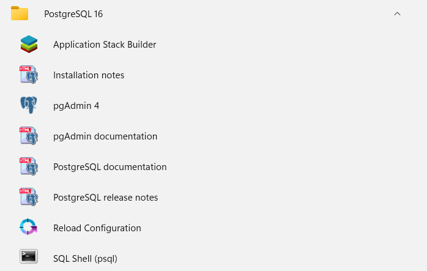
- Press enter until you get to the password, then enter the password as 12345678
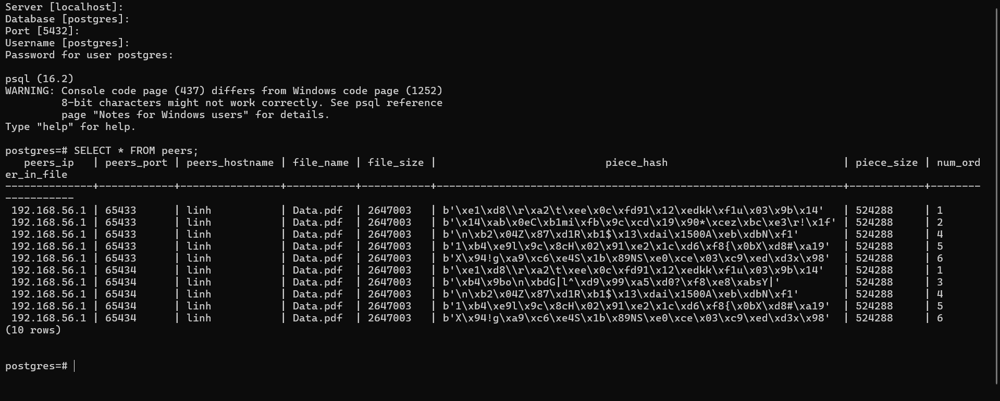
## Installation
Installation from source is straightforward:
```
$ git clone https://github.com/nguyenminhlinh/HCMUT_CO3093_ComputerNetworks_Assignment1.git
$ cd HCMUT_CO3093_ComputerNetworks_Assignment1
```
## Usage
1. Create database with SQL Shell (PostgreSQL) by file server/db.txt 
2. Start the central server:
   - $ cd server
   - Run the `server.py` script to start the central server. Ensure the server is running before proceeding with client actions.

3. Client Setup:
   - $ cd client1
   - $ cd client2
   - $ cd client3
   - Edit the `SERVER_HOST`, `SERVER_PORT`, `CLIENT_PORT` setting in the `client.py` file to configure the IP for the central server. After that run the `client.py` script to start the client and connect to the central server.

## Features

1. The client has a simple command-shell interpreter that is used to accept two kinds of commands.
    - `publish file_name file_name2`: A set of local files on the client machine is divided into parts (size of each part is 512kb). Users can select pieces shared content to send information to the server.
    
    - `fetch file_name file_name2`: The server sends information about parts of files shared by peers that are not yet available to clients. Clients can choose any part to download. Once all parts are downloaded, they will be merged into one original file.

## Example
Server chưa có dữ liệu nào. Và thông tin file các client đang có.

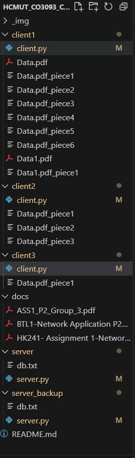
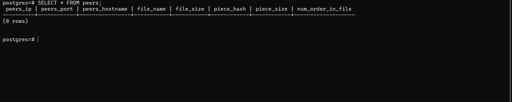

1. Server có 3 client đang trực tuyến: Client 1, Client 2, Client 3

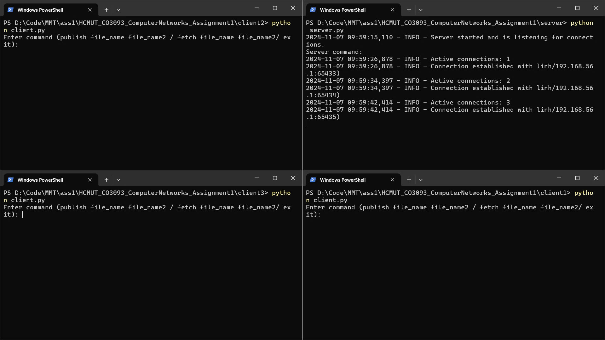

2. Publish file Data.pdf, Data1.pdf từ Client 1 lên server. 

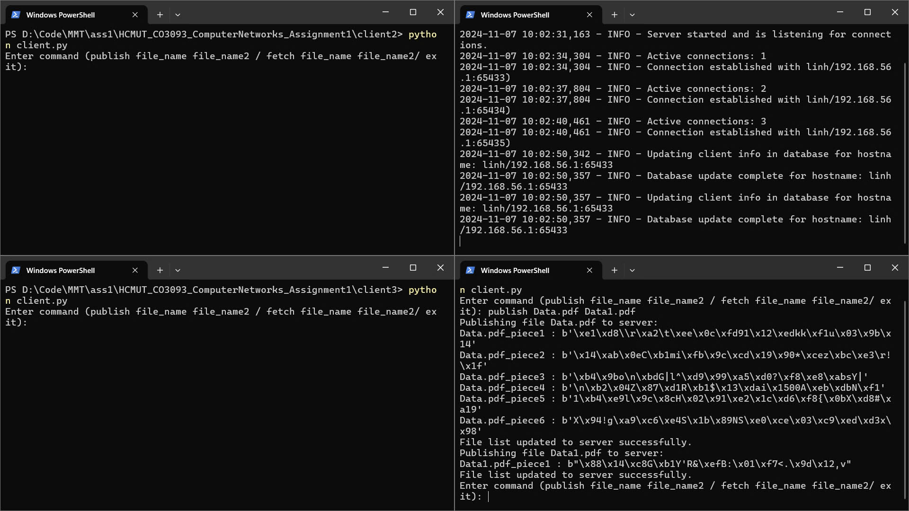
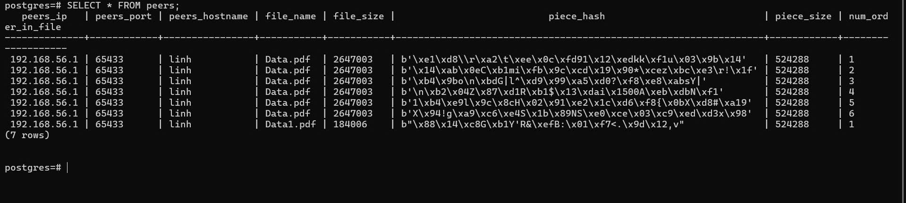

3. Publish file Data.pdf(piece 1, 2, 3) từ Client 2 lên server. 

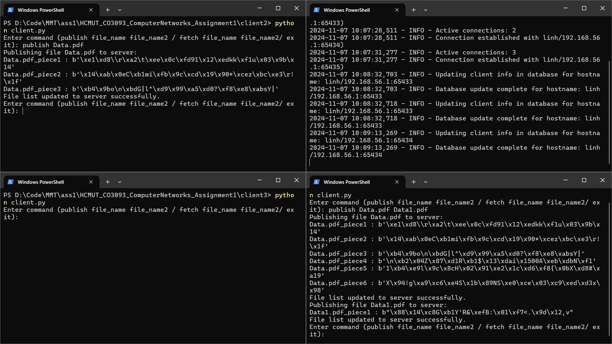
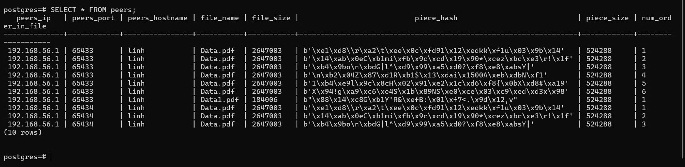

3. Exit Client 1.

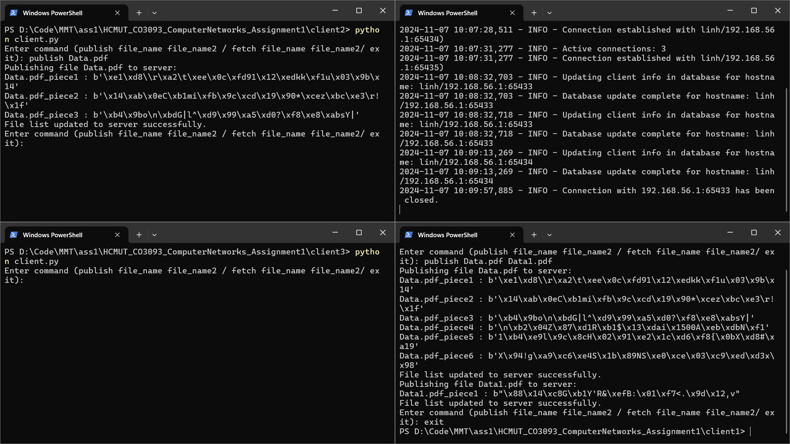

4. Client 3 yêu cầu fetch file Data.pdf, Data1.pdf lên server. Chỉ có piece 2,3 của Data.pdf được tải do client3 có sẵn piece1 và chỉ có client2 on còn client1 đã off. Sau khi tải piece 2,3 thì client2 chia sẽ lên server là đang chứa piece 2,3 của file Data.pdf. Và thông báo không đủ các piece để tạo ra file Data.pdf.

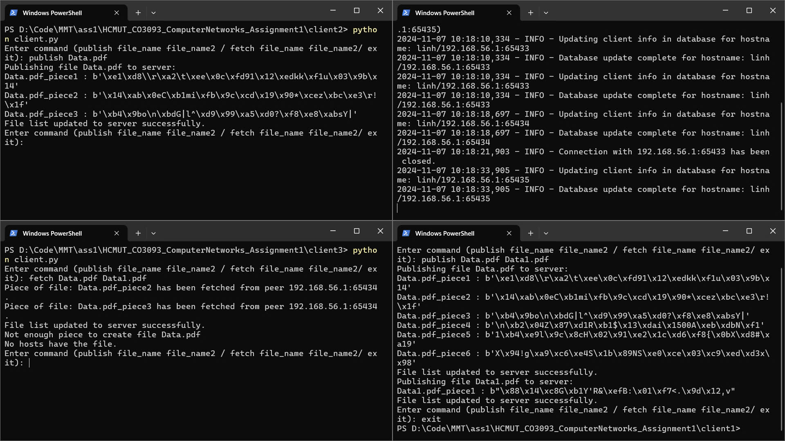

5. Khởi động lại Client 1 và Fetch Data.pdf Data1.pdf từ Client 3. Client 3 sẽ tải piece 4,5,6 của Data.pdf và piece1 của Data1.pdf.  Sau khi tải piece 4,5,6 của Data.pdf và piece1 của Data1 thì client2 chia sẽ lên server là đang chứa piece 4,5,6 của Data.pdf và piece1 của Data1. Sau đó Client3 merger các piece thành file Data.pdf và Data1.pdf.

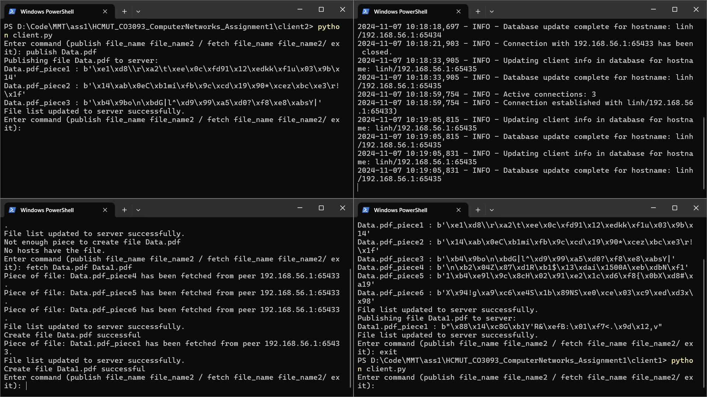
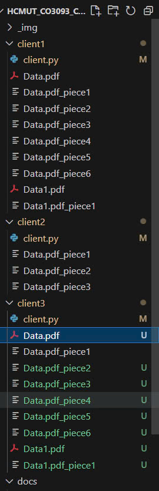

6. Client 2 có file Data2.pdf (tự thêm vào). Sau đó server bị shutdown bằng ctrl + C. Sau đó server backup được khởi động.

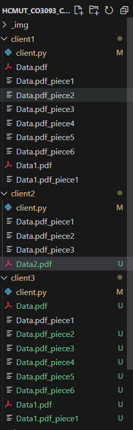
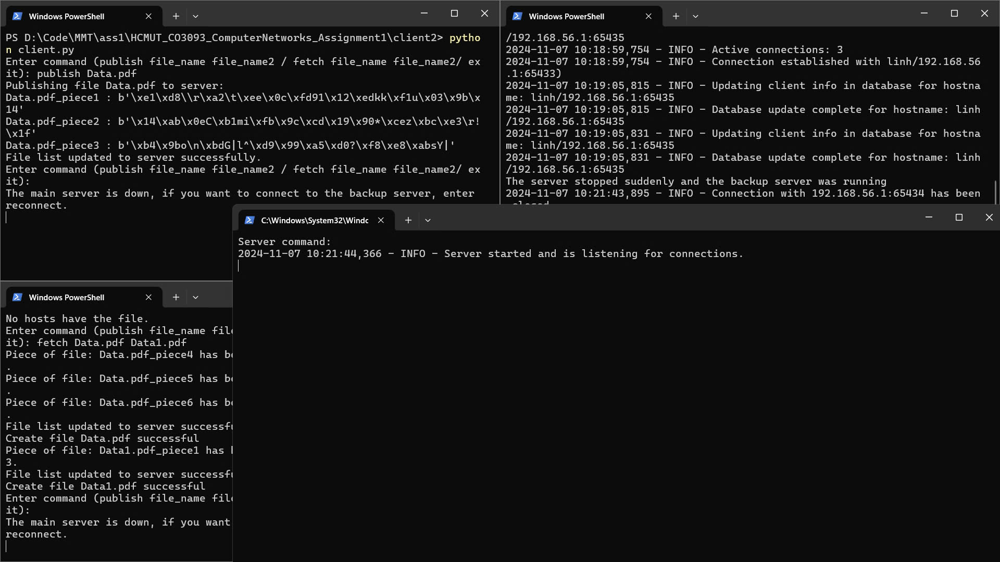

7. Các client được thông báo "The main server is down, if you want to connect to the backup server, enter reconnect". Nhập `reconnect` để kết nối lại với server backup. 

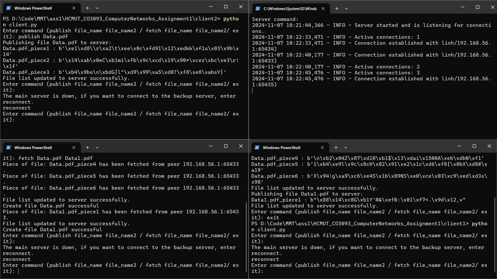

8. Sau khi kết nối lại, kiểm tra chức năng publish Data2.pdf từ client2. Chức năng hoạt động tốt in ra thông báo  
`Publishing file Data2.pdf to server:
Data2.pdf_piece1 : b'8\xecs\xd3\xb5\x18\x944c\x08<\xd2\x1d\xe4\x8b\xea\xc3\xef&l'
File list updated to server successfully`

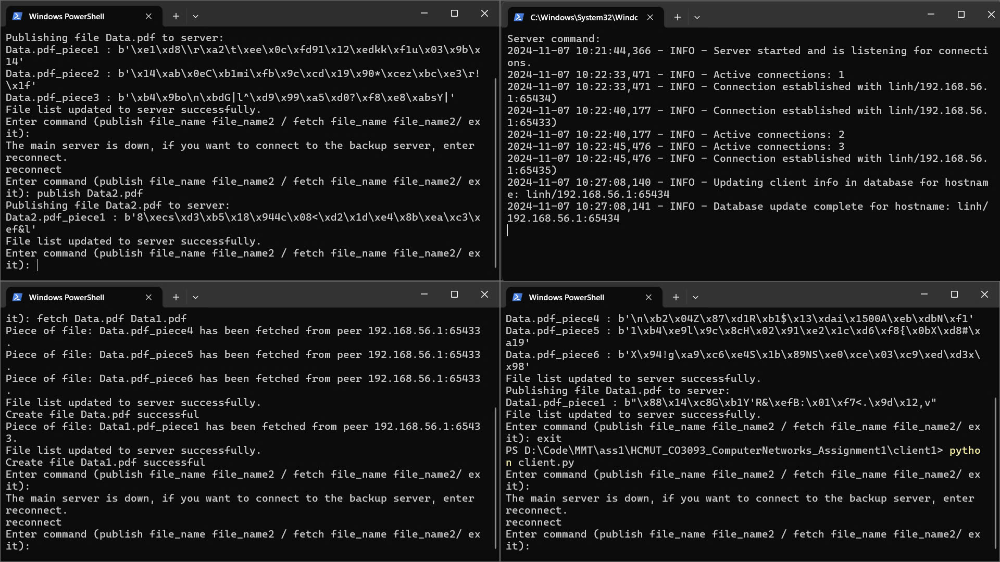

9. Kết quả trong database của server cũng cập nhập Data2.pdf

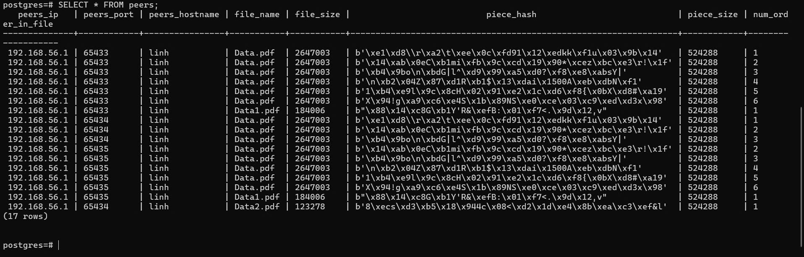

